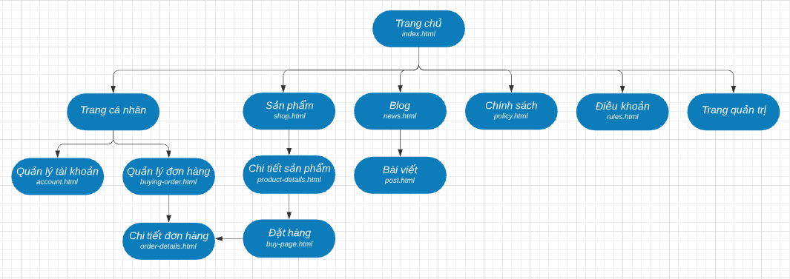
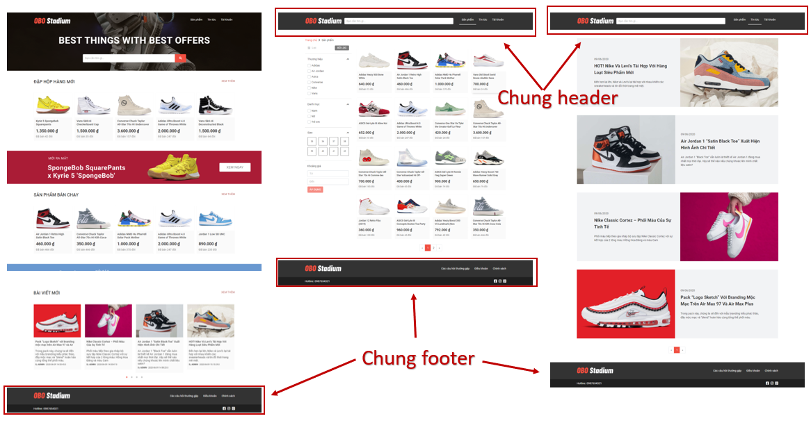

#Bước 2: Dựng layout trang web

> Website demo được xây dựng từ template [Obo Stadium](https://cody0203.github.io/normal-obo-stadium/), có chỉnh sửa đề phù hợp với nghiệp vụ của một trang thương mại điện tử

<br>

####Source code template (đã chỉnh sửa)
[Xem tại đây](../normal-obo-stadium) 

####Sơ đồ các trang thuộc website tĩnh


**Tình trạng:** Nhận thấy các trang đều có chung một cấu trúc: Header - Body - Footer. Trong đó footer ở tất cả các trang như nhau. Header có 2 loại: header lớn có chứa ảnh ở trang chủ, header thu gọn ở các trang còn lại.<br>
===> Có sự lặp lại source code phần header, footer. Ngoài ra các phần khác như modal đăng nhập, modal chọn size giày,... cũng bị lặp lại trong code.<br>
===> **Vấn đề:** Dư thừa. Dễ gây thiếu sót khi có sự thay đổi.<br>
===> **Giải pháp:** Xác định các đoạn code chung được lặp lại nhiều lần, gom thành các component cần thì gọi ra để tái sử dụng. 



Component trong Thymeleaf gọi là **fragment**. Thymeleaf sử dụng các fragment để lắp ghép lại với nhau tạo thành một **layout**.


####Thực hành dựng layout
- Copy các file tĩnh được sử dụng trong template vào thư mục **/static**. Nên giữ nguyên cách phân chia thư mục (css, image, script, vendor) để tiện tham chiếu.
- Tạo thư mục **/templates/fragment** để chứa các fragment. 
- Tạo các fragment: footer, header, login modal, size choose modal. Mỗi fragment đặt trong một file html có tên gợi nhớ. 
<br>VD: Tạo fragment footer
<br>Copy/paste source code footer vào file footer.html, đặt trong thẻ <th:block> ---> Đặt tên fragment là "footer" ---> Thay thế các tham chiếu đến static resources (ảnh, link) bằng cú pháp Thymeleaf 
```html
<th:block th:fragment="footer">
   // Paste footer vào đây
</th:block>
```
- Tạo layout:
    - Tạo thư mục **/templates/layout**
    - Tạo file layout.html chứa fragment tên là "main-fragment" đặt trong thẻ bao "html". Fragment này có 5 tham số bắt buộc (title, header, cssResources, jsResources, mainContent), là định danh của các fragment, được sử dụng để chèn các nội dung tùy biến của từng trang vào layout.
    - Thêm các thẻ và fragment chung để tạo ra source code html hoàn chỉnh gồm có head (title, phần css chung, css riêng cho từng trang), body (header, main content, footer, js chung, js riêng từng trang, các modal chung)
```html
<!DOCTYPE HTML>
<html xmlns:th="http://www.thymeleaf.org" th:fragment="main-fragment(title, header, cssResources, jsResources, mainContent)">
    <head>
        <title th:replace="${title}">Page Title</title>
        
        <meta charset="UTF-8" />        
        <link rel="icon" th:href="@{/image/favicon.ico}" type="image/x-icon"/>
        <link rel="shortcut icon" th:href="@{/image/favicon.ico}" type="image/x-icon"/>
        <meta name="viewport" content="width=device-width, initial-scale=1, shrink-to-fit=no"/>
        <meta http-equiv="X-UA-Compatible" content="ie=edge"/>
        
        <!-- Common CSS Start -->
        // Thêm các link css dùng chung vào đây
        <!-- Common CSS End -->

        <!-- Components CSS -->
        <th:block th:replace="${cssResources} ?: ~{}"></th:block>
    </head>
    <body>
        <!-- HEADER -->
        <th:block th:replace="~{fragment/header :: ${header}}"></th:block>

        <!-- BODY -->
        <th:block th:replace="${mainContent} ?: ~{}"></th:block>

        <!-- LOGIN MODAL -->
        <th:block th:replace="~{fragment/login_modal :: login-modal}"></th:block>

        <!-- FOOTER -->
        <th:block th:replace="~{fragment/footer :: footer}"></th:block>

        </div><a class="back-to-top" href="#"></a>

        <!-- Common JS Start -->
            // Thêm các link js dùng chung vào đây
        <!-- Common JS End -->
            
        <!-- Inline script --> 
        <script th:inline="javascript">

        </script>

        <!-- Components JS-->
        <th:block th:replace="${jsResources} ?: ~{}"></th:block>
    </body>
</html>
```


####Tham khảo
- Hướng dẫn sử dụng fragments: https://openplanning.net/12371/thymeleaf-fragment
- Hướng dẫn sử dụng layout: https://openplanning.net/12369/thymeleaf-page-layout