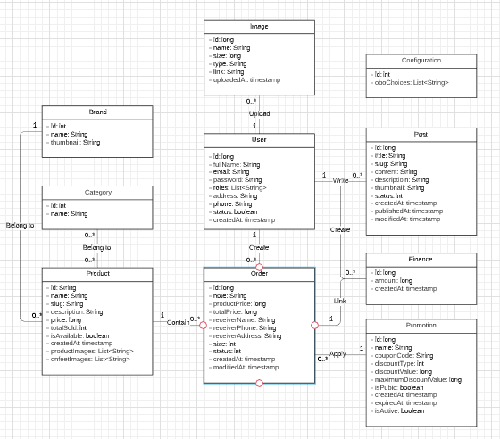

# Bước 4: Render

> Ở bước 3, chúng ta đã dựng được template thành website tĩnh. Để biến thành website động, cần bổ sung thêm entity, repository, service và xử lý controller để trả ra data đồng thời sử dụng cú pháp Thymeleaf để render

### Bài tập 1: Tạo entity và repository theo thiết kế database

 
https://docs.google.com/document/d/1-6Ru2IOioTl3lg0s0TrXmLUL3CNCRertbH4wIG_1z78/edit?usp=sharing

### Bài tập 2: Làm động trang tin tức
#### Yêu cầu:
- Hiển thị danh sách bài viết đã xuất bản (status = 1), sắp xếp theo thời gian xuất bản (từ mới đến cũ)
- Có phân trang. Số lượng bài viết một trang cố định (8)
- Mặc định load trang 1 khi click vào mục tin tức. Đường dẫn khi đó là /tin-tuc. Chuyển trang đường dẫn là /tin-tuc?page=n (với n là số trang). Cần xử lý trường hợp user nhập n là chữ ---> Redirect về trang hiển thị lỗi 500 thay vì hiển thị Whitelabel Error Page
- Đường dẫn xem chi tiết bài viết có dạng: /tin-tuc/{slug}/{id}  
  VD: /tin-tuc/hot-nike-va-levis-tai-hop-voi-hang-loat-sieu-pham-moi/4

#### Gợi ý:
Xảy ra lỗi khi mapping request --> Spring Boot sẽ tự động redirect đến trang /error, hiển thị Whitelabel Error Page. 

Để giao diện thân thiện hơn không gây hoang mang cho người dùng nên custom lại giao diện thông báo lỗi.  
Tạo template **error.html** trong thư mục **/resources/template** --> Tự động được lựa chọn để render bởi BasicErrorController cho đường dẫn /error.  
Chúng ta cũng có thể custom trang lỗi bằng cách đặt tên file template trong thư mục **/resources/template/error** theo status code 
VD: 404.html sẽ được sử dụng cho lỗi 404

Tham khảo: https://www.baeldung.com/spring-boot-custom-error-page

### Bài tập 3: Làm động trang chi tiết tin tức 

