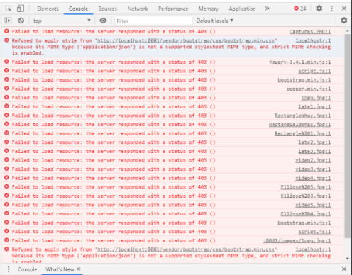

# Bước 6: Phân quyền và xác thực sử dụng JWT token

### Hướng dẫn phân quyền và xác thực với JWT
Tham khảo các bài viết trên trang Loda.me:
- [Spring Security Cơ bản](https://loda.me/huong-dan-spring-security-co-ban-de-hieu-loda1556592373421)
- [Spring Security + Hibernate](https://loda.me/huong-dan-spring-security-jpa-hibernate-loda1556631547828)
- [Spring Security + JWT (Json Web Token) + Hibernate](https://loda.me/huong-dan-spring-security-jwt-json-web-token-hibernate-loda1556683105052/)


### Hướng dẫn cấu hình [CORS](https://topdev.vn/blog/cors-la-gi/)
https://www.baeldung.com/spring-cors

### Cấu hình serve các file resources
Sau khi nhúng Spring security, khi serve các file resource (ảnh, file css, file js,...) bị lỗi 403 như hình ---> Cần cấu hình để bỏ qua không thực hiện xác thực với các yêu cầu serve file tĩnh

WebSecurityConfig.class
```java
@Configuration
@EnableWebSecurity
public class WebSecurityConfig extends WebSecurityConfigurerAdapter {
    ...
    @Override
    public void configure(WebSecurity web) throws Exception {
        // Các file tĩnh của mình nằm trong thư mục /css, /script, /image, /vendor
        web
                .ignoring()
                .antMatchers("/css/**", "/script/**", "/image/**", "/vendor/**", "/favicon.ico", "/media/static/**");
    }
}
```
WebMvcConfig.class
```java
@Configuration
@EnableWebMvc
public class WebMvcConfig implements WebMvcConfigurer {
    @Override
    public void addResourceHandlers(ResourceHandlerRegistry registry) {
        registry.addResourceHandler("/image/**").addResourceLocations("classpath:/static/image/")
                .setCacheControl(CacheControl.maxAge(2, TimeUnit.HOURS).cachePublic());
        registry.addResourceHandler("/vendor/**").addResourceLocations("classpath:/static/vendor/")
                .setCacheControl(CacheControl.maxAge(2, TimeUnit.HOURS).cachePublic());
        registry.addResourceHandler("/script/**").addResourceLocations("classpath:/static/script/")
                .setCacheControl(CacheControl.maxAge(2, TimeUnit.HOURS).cachePublic());
        registry.addResourceHandler("/css/**").addResourceLocations("classpath:/static/css/")
                .setCacheControl(CacheControl.maxAge(2, TimeUnit.HOURS).cachePublic());
    }
}

```

### Cấu hình middleware
Trong ví dụ này mình có cấu hình 1 Interceptor với nhiệm vụ phân tích object Authentication được lưu trong SecurityContextHolder và trả về thêm data (đã login hay chưa, nếu login rồi thì trả về thông tin user đang đăng nhập) để render html. Interceptor này sẽ được chạy sau hàm xử lý request trả về view ---> Sử dụng Interceptor để tối ưu code thay vì phải lặp lại ở các hàm xử lý<br>
ConfigInterceptor.class
```java
public class ConfigInterceptor extends HandlerInterceptorAdapter {
    @Override
    public void postHandle(HttpServletRequest request, HttpServletResponse response, Object handler, ModelAndView modelAndView) throws Exception {
        Authentication authentication = SecurityContextHolder.getContext().getAuthentication();
        if (!authentication.getAuthorities().contains(new SimpleGrantedAuthority("ROLE_ANONYMOUS"))) {
            CustomUserDetails principal = (CustomUserDetails) authentication.getPrincipal();
            modelAndView.addObject("user_fullname", principal.getUser().getFullName());
            modelAndView.addObject("user_phone", principal.getUser().getPhone());
            modelAndView.addObject("user_email", principal.getUser().getEmail());
            modelAndView.addObject("user_address", principal.getUser().getAddress());
            modelAndView.addObject("isLogined", true);
        } else {
            modelAndView.addObject("isLogined", false);
        }
    }
}
```
WebMvcConfig.class
```java
@Configuration
@EnableWebMvc
public class WebMvcConfig implements WebMvcConfigurer {
    @Override
    public void addInterceptors(InterceptorRegistry registry) {
        // Không áp dụng với các request có endpoint bắt đầu bằng /images, /vendor, /css, ...
        registry.addInterceptor(new ConfigInterceptor())
                .excludePathPatterns("/image/**", "/vendor/**", "/css/**", "/script/**", "/api/**", "/api/register", "/favicon.ico", "/adminlte/**", "/media/static/**");
    }
}

```

<br>

Tham khảo: 
- https://openplanning.net/11689/spring-boot-interceptor
- https://www.baeldung.com/spring-mvc-handlerinterceptor